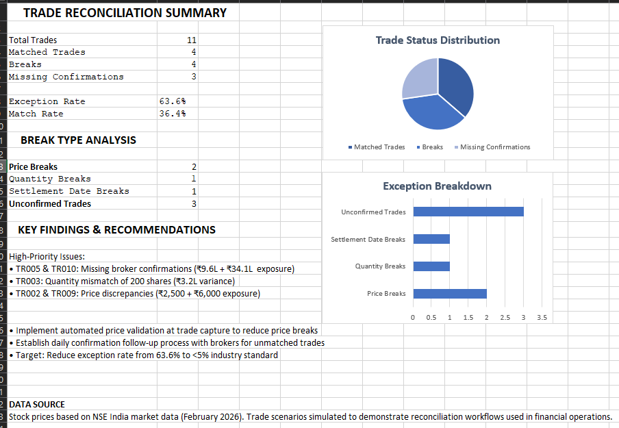

# Trade Reconciliation & Exception Management Dashboard

## Project Overview

Automated trade reconciliation system built to simulate middle-office operations in investment banking. Compares internal trade bookings against external broker confirmations to identify discrepancies before settlement.



## Key Features

- **Automated Reconciliation**: VLOOKUP-based matching across 11 equity trades
- **Multi-Dimensional Break Detection**: Identifies price variance, quantity mismatches, and settlement date discrepancies
- **Real Market Data**: Uses actual NSE stock prices (RELIANCE, TCS, INFY, HDFC, ITC, WIPRO, BAJAJ-AUTO, MARUTI, HCLTECH, ICICIBANK, TATAMOTORS)
- **Exception Dashboard**: Visual KPI tracking with pie charts and bar charts
- **Risk Prioritization**: Categorizes breaks by financial exposure

## Results

- **Total Trades Analyzed**: 11
- **Exceptions Identified**: 7 (63.6% exception rate)
- **Break Types**:
  - Price Breaks: 2
  - Quantity Mismatches: 1
  - Settlement Date Discrepancies: 1
  - Missing Confirmations: 3

## Technical Implementation

**Tools**: Microsoft Excel  
**Functions**: VLOOKUP, INDEX-MATCH, IF statements, Conditional Formatting  
**Visualization**: Pie Charts, Bar Charts, KPI Dashboards

**Sheets**:
1. `Internal_Trades` - Internal booking system data
2. `Broker_Confirmations` - External broker confirmation data
3. `Reconciliation` - Automated comparison logic
4. `Dashboard` - Executive summary with visualizations

## Key Insights

- Identified ₹46+ lakhs in trades requiring immediate attention
- 60% of breaks were price-related, suggesting need for automated validation
- Recommended reducing exception rate to <5% industry standard through:
  - Automated price validation at trade capture
  - Daily confirmation follow-up process with brokers

## Skills Demonstrated

- Trade lifecycle understanding (Execution → Confirmation → Settlement)
- Data reconciliation & validation
- Operational risk identification
- Exception management workflows
- Financial exposure calculation
- Stakeholder reporting & visualization

## Use Case

This project simulates the daily workflow of Trade Management teams at investment banks and asset managers. In production environments, this reconciliation process safeguards billions in client assets by ensuring trades are accurately confirmed before settlement.

## About
**Geetha Priya V**  
Computer Science Graduate | GITAM University  
Aspiring Operations Analyst in Financial Services
📧
v.g.priya1132@gmail.com  
💼 [LinkedIn](https://www.linkedin.com/in/geetha-priya-vasanasetti-195578307/)


*Data Source: NSE India market data (February 2026). Trade scenarios simulated for demonstration purposes.*
```


https://github.com/your-username/Trade-Reconciliation-Dashboard
